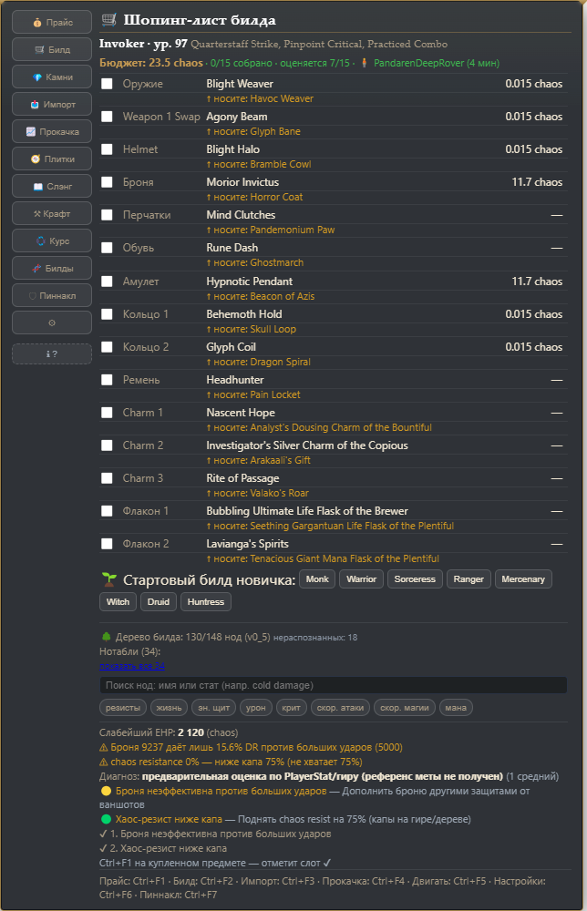
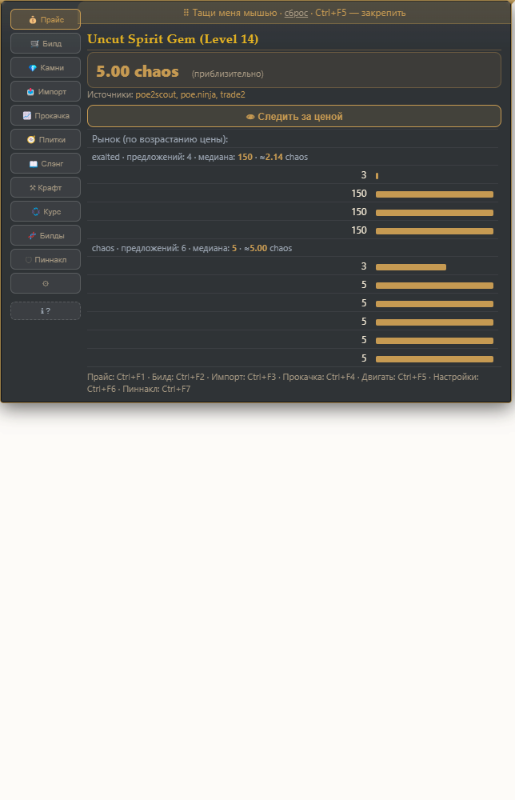

# poe2-kit

[](README.en.md)
[](https://github.com/WarnetBes/poe2-kit/actions/workflows/ci.yml)

Единый помощник для **Path of Exile 2**: гид по прокачке, AI-советы, универсальная торговля, анализ билдов и прайс-чек предметов.

<div align="center">
<a href="docs/screenshots/overlay-build.png"></a>
<a href="docs/screenshots/overlay-price.png"></a>
</div>

Одно ядро **`@poe2-kit/core`** обслуживает три формы помощника:

| Форма | Пакет | Что это |
|---|---|---|
| 🌐 Веб-приложение | `apps/web` | Дашборд: курсы валют, прайс-чек, гид по прокачке, импорт билда |
| 🖥️ Windows-оверлей | `apps/overlay` | Прозрачное окно поверх игры: прайс-чек по хоткею, вкладки панели (билд, 💎 Камни, прокачка, настройки), автопрайс из буфера, watchlist с алертами |
| 🧠 MCP-сервер для ИИ | `apps/mcp` | 59 инструментов `poe2_*` для ИИ-ассистентов (OpenCode и др.) |

Цены и торговля — **только с бесплатных публичных API**: [poe.ninja](https://poe.ninja), [poe2scout](https://poe2scout.com), официальный `trade2` Path of Exile 2 и открытые данные RePoE. Ключей не требуется.

---

## Структура

```
poe2-kit/
├── packages/core/          # единое ядро (всё, что можно переиспользовать)
│   └── src/
│       ├── parse.ts        # парсер предмета из клир-текста (Ctrl+C в игре)
│       ├── trade.ts        # poe.ninja / poe2scout / trade2, прайс-чек валют и предметов
│       ├── leveling.ts     # гид по прокачке (акты 1–4, 65 зон)
│       ├── build.ts        # декод PoB share-кода (urlsafe base64 + zlib + XML)
│       ├── ai.ts           # AI-советы (поставщик подключается в рантайме)
│       ├── http.ts         # сетевой слой (+ опциональный CORS-прокси для браузера)
│       └── index.ts        # публичный API: export const core = { … }
├── apps/
│   ├── web/                # Vite + vanilla TS (Vite dev/preview reverse-proxy для обхода CORS)
│   ├── overlay/            # Electron: хоткей Ctrl+Alt+Space → прайс-чек из буфера
│   └── mcp/                # MCP-сервер (stdio), инструменты poe2_*
└── _research/              # скачанные сторонние репозитории (авторство сохранено)
```

---

## Быстрый старт

### Как скачать и начать пользоваться (не-программисту)

Готового установщика .exe нет — распространяется исходником, но запуск автоматизирован.

1. **Скачать**: **GitHub Releases** (зеркало, прямой анонимный доступ):
   [github.com/WarnetBes/poe2-kit/releases/latest](https://github.com/WarnetBes/poe2-kit/releases/latest)
   → последний релиз (v1.0.19):
   - **`poe2-kit-portable-…-win64.zip`** (37 МБ) — рекомендую: распаковать →
     запустить `start-overlay.bat`. Node.js и npm не нужны; при первом запуске
     скрипт один раз скачает движок Electron (~110 МБ), дальше — офлайн.
   - (Либо «Source code (zip)» на любой из площадок — вариант «собери
     сам»: нужен Node.js ≥ 20 и интернет для первого запуска. Либо с git:
     `git clone https://git.sourcecraft.dev/volkovpartilaholin/poe2-kit.git`)
2. **Для варианта «Source code»**: если Node.js не установлен — один раз
   запустите `install-tools-minimal.bat` (скачает и поставит Node.js сам),
   или с https://nodejs.org/. Для portable этот шаг не нужен.
3. **Запустить нужную форму**:
   - **`start-overlay.bat`** — оверлей поверх игры (Windows). В игре: навести на
     предмет → Ctrl+C → **Ctrl+F1** — цена; Ctrl+F3 — импорт билда; Ctrl+F6 —
     настройки. Лог: `%APPDATA%\@poe2-kit\overlay\overlay.log`.
   - **`start-web.bat`** — дашборд в браузере: http://localhost:5173
     (прайс-чек, дерево, чек-лист прокачки, сравнение с лестницей).
   - **`start-mcp.bat`** — MCP-сервер для ИИ-ассистентов (55 инструментов
     `poe2_*`; подключается в OpenCode/другой MCP-клиент, stdio).

В portable-сборке bat-файлы видят маркер `.portable`: `start-overlay.bat`
работает **без установленного Node.js** — Electron он скачивает сам при первом
запуске (дальше офлайн), компиляция пропускается. Собрать такой архив:
`npm run portable` (для мейнтейнера; `node make-portable.mjs --full` — вариант
с Electron внутри, ~190 МБ, для своих ПК: лимит вложений релиза — 100 МБ).

Отзывы/баги/идеи → [CONTRIBUTING.md](CONTRIBUTING.md) и issues на SourceCraft.
История версий — [CHANGELOG.md](CHANGELOG.md).

### Дальше — для разработчика

Требуется **Node.js ≥ 20**.

```bash
npm install          # установка зависимостей (workspaces)
npm run build        # сборка ядра
```

### Веб-приложение

```bash
npm run build -w @poe2-kit/web   # tsc + vite build
npm run dev    -w @poe2-kit/web  # dev-сервер с прокси (localhost:5173)
npm run preview -w @poe2-kit/web -- --port 5173  # production-preview
```

Веб-приложение: **Курсы валют**, **Прайс-чек**, **Прокачка**, **Импорт билда** (разобранный билд можно сразу **оценить по живым ценам** кнопкой «Оценить снаряжение»).

> **Про CORS.** Браузеры блокируют прямое обращение к poe.ninja/poe2scout/trade. Поэтому в ядре есть `core.http.setProxyBaseMap({ host → prefix })`, а Vite (`server.proxy` / `preview.proxy`) реверсивно-проксирует `/proxy/* →` внешние хосты. В Node (MCP, оверлей) прокси не нужен — запросы идут напрямую.

### Windows-оверлей (Electron)

```bash
npm run dev -w @poe2-kit/overlay   # сборка + запуск Electron
npm run build -w @poe2-kit/overlay
npm run test -w @poe2-kit/overlay  # --smoke: окно, хоткей, парсер
```

- В игре скопируйте предмет (`Ctrl+C` — PoE2 кладёт клир-текст в буфер) и нажмите **`Ctrl+Alt+Space`**.
- Прозрачное, безрамочное, always-on-top окно: клики «проходят сквозь» него в игру.
- Оверлей **привязывается к окну Path of Exile 2**: следит за его положением и держится у правого верхнего угла игрового окна; прячется, когда игра свёрнута или не в фокусе.
- Рядом с игрой приложение находит через Win32 (`user32.dll`) через нативный FFI-модуль `koffi` (N-API, работает и в Electron без пересборки).
- Оценка считается в main-процессе напрямую через ядро (без CORS).

### MCP-сервер

```bash
npm run start -w @poe2-kit/mcp           # stdio MCP-сервер
npm run test  -w @poe2-kit/mcp           # build + --smoke
npm run start -w @poe2-kit/mcp -- --smoke
```

Инструменты `poe2_*` (**60**): валюта/лиги, прайс-чек и разбор предметов, живые цены рун (poe2_rune_prices: фильтры name/tier/kind по аугментам — руны и soul cores), прокачка (8 классов), декод и оценка билдов (`poe2_build_estimate`), «следующий апгрейд» (`poe2_build_advice`), сравнение с топ-лестницей (`poe2_build_compare`), скелет гайда (`poe2_build_guide`), дерево пассивок (поиск + резолв узлов по ID `poe2_tree_ids`), гемы, статус/конфиг персонажа (локально; сессии игры + реальные имена зон из лога), лестница и мета-скиллы poe.ninja, калькуляторы (Spirit/EHP/станы/статы врагов/статусы/базовые пулы life/mana/ES по канону PoB2), OAuth+персонажи, wiki/poe2db, AI, библиотека источников (`poe2_sources_list`/`poe2_sources_fetch`), живое состояние оверлея (`poe2_overlay_state`/`poe2_overlay_gaps`) и канал агент→оверлей (`poe2_overlay_notify`, `poe2_overlay_watch_add`/`_remove` — тост поверх игры и запись в watchlist игрока).
Перейти к примерам и «как что считается» — раздел [MCP-инструменты](#mcp-инструменты) ниже; компактная шпаргалка для ИИ — `apps/mcp/ASSISTANT_GUIDE.md`.

---

## MCP-инструменты (59)

Все инструменты — префикс `poe2_*`, данные только из бесплатных публичных API
и локальной базы RePoE (кроме `poe2_log_state`/`poe2_game_config` — читают локальные
файлы, и `poe2_ai_ask` — настроенный LLM). Сгруппированы по назначению; пример —
типичный запрос для ИИ-ассистента.

### Валюта и лиги (5)

| Инструмент | Что делает | Пример запроса |
|---|---|---|
| `poe2_currency_prices` | Курсы всех валют в chaos (poe.ninja) | «Курсы валют» |
| `poe2_currency_check` | Цена конкретной валюты | «Сколько стоит Exalted Orb?» |
| `poe2_currency_history` | История курса валюты: тренд, скачки, ATH | «Тренд курса Divine Orb за неделю» |
| `poe2_price_history` | История цены предмета | «Как менялась цена на этот уникал» |
| `poe2_leagues` | Актуальный список лиг (активные ✦) | «Какая сейчас лига?» |

### Предметы и прайс-чек (5)

| Инструмент | Что делает | Пример запроса |
|---|---|---|
| `poe2_parse_item` | Структурный разбор клир-текста: редкость, база, моды, требования, урон/защита | «Разбери этот предмет» + Ctrl+C-текст |
| `poe2_price_check` | Прайс-чек предмета (Trade или SSF-разбор) | «Сколько стоит это?» + Ctrl+C-текст |
| `poe2_trade_search` | Trade-запросы к официальному `trade2` ИЗ клир-текста; `execute=true` → живые листинги | «Найди похожие на trade» + Ctrl+C-текст |
| `poe2_items_db` | База предметов RePoE: база, класс, теги, требования, броня/ES/ev, — и подходящие фрактуред-моды | «Что за база Iron Greaves?» |
| `poe2_mod_tier` | Тир мода по тексту и тегам | «Какой тир у этого мода?» |

### Билды (PoB, 8)

| Инструмент | Что делает | Пример запроса |
|---|---|---|
| `poe2_build_decode` | Точный декод share-кода: XML, класс/асц, навыки, пассивки, treeVersion, снаряжение | «Декодируй share-код» |
| `poe2_build_summary` | Краткая сводка по XML билда + разбивка «откуда цифра» | «Что в этом билде?» |
| `poe2_build_price` | Прайс-чек всего снаряжения билда (по share-коду/XML/ссылке) | «Оцени снаряжение билда» |
| `poe2_build_estimate` | Приближённая оценка EHP/DPS без PoB-движка; слабые места защиты | «Оцени мой билд» |
| `poe2_build_advice` | «Следующий апгрейд»: приоритеты «чини → потом» + референс меты класса | «Что улучшить первым?» |
| `poe2_build_compare` | Свой билд vs топ-лестница класса: перцентиль DPS/EHP | «Насколько мой билд лучше среднего?» |
| `poe2_export_build_planner` | Экспорт билда PoB в официальный *.build (Build Planner PoE2, schema v1) — импорт в игру | «Сделай .build для импорта в игре» || `poe2_build_guide` | Скелет 9-секционного гайда по шаблону: проверяемые данные подставлены, текст — заглушки | «Сгенерируй скелет гайда по моему билду» |

### Датасеты / дерево / гемы (9)

| Инструмент | Что делает | Пример запроса |
|---|---|---|
| `poe2_dataset_info` | Версии офлайн-датасетов + список асценданси | «Версии данных и асценданси» |
| `poe2_gems_lookup` | Поиск гема: статы, требований, источник (Uncut/quest/drop) | «Что за гем Ice Strike?» |
| `poe2_support_gems_lookup` | Поиск саппорт-гема | «Саппорты к Ice Strike» |
| `poe2_tree_search` | Поиск узлов дерева по имени | «Найди узел Moment of Truth» |
| `poe2_tree_search_stats` | Поиск узлов по НАБОРУ статов (AND-агрегат) | «Узлы с +энергосщитом и институтом» |
| `poe2_tree_ids` | Резолв узлов по ID (символьные и числовые) | «Что за узлы ID-списка из билда?» |
| `poe2_ascendancy_nodes` | Узлы асценданси | «Ноды Acrobatics» |
| `poe2_stat_explain` | Объяснение стата | «Что значит Spirit?» |
| `poe2_data_freshness` | Свежесть данных всех источников (кэш) | «Актуальны ли цены?» |

### Прокачка (3)

| Инструмент | Что делает | Пример запроса |
|---|---|---|
| `poe2_leveling_plan` | Пошаговый план актов 1–4 (65 зон, награды, bind-камни) | «План прокачки до начала карт» |
| `poe2_leveling_class` | Прокачка под конкретный класс | «Как качать Witch?» |
| `poe2_leveling_context` | Живой контекст прокачки из Client.txt: текущая зона + заметки + следующие 3 зоны | «Где я и что дальше?» |

### Персонаж — локально (2)

| Инструмент | Что делает | Пример запроса |
|---|---|---|
| `poe2_log_state` | Живое состояние из Client.txt: зона (реальное имя из SCENE), уровень/класс, смерти, AFK, сервер, границы игровых сессий (`sessions`) | «Сколько я умер за сессию?» |
| `poe2_game_config` | Конфиг клиента из INI: режим ввода, акт, разрешение | «Какой у меня режим ввода?» |

### Калькуляторы механик (6)

| Инструмент | Что делает | Пример запроса |
|---|---|---|
| `poe2_ehp` | Эффективное HP по типам урона, послойный разбор | «Какой EHP у моего билда?» |
| `poe2_spirit` | Бюджет резервации Spirit / «что влезает в остаток» | «Хватит ли Spirit на эти ауры?» |
| `poe2_stun` | Расчёт станов | «Буду ли я станаться?» |
| `poe2_enemy_stats` | Статы врагов (по seed/уровню) | «Статы босса этого акта» |
| `poe2_ailments` | Статусы/ауры (ailments) | «Как работает Shock?» |
| `poe2_base_pools` | Базовые life/mana/ES и реген маны по канону PoB2 (12·lvl+16 / 4·lvl+30) | «Сколько жизни будет на 30 уровне?» |

### Optimize-аудит билда (3)

| Инструмент | Что делает | Пример запроса |
|---|---|---|
| `poe2_evaluate_build` | Билд против числовых целей (DPS/EHP/резисты/Spirit): verdict + разрыв, каждое число помечено computed:/estimated: | «Держит ли билд цели: 1M DPS, 8k EHP, резисты 75%?» |
| `poe2_rank_levers` | Ранжирование рычагов апгрейда по ΔEHP (computed: пересчёт слоёв) и ΔDPS-оценке (estimated: оружие) | «Что даст больше: +80 жизни или +30 резистов?» |
| `poe2_pinnacle_check` | Чек-лист готовности к эндгейму против табличных статов босса | «Готов ли я к пиннакл-боссу 84 уровня?» |

### Мета и лестница — poe.ninja (3)

| Инструмент | Что делает | Пример запроса |
|---|---|---|
| `poe2_ladder_top` | Топ-билды лиги: класс, сортировка, лимит | «Что играют топ-Invoker-и?» |
| `poe2_ladder_leagues` | Снапшот-лиги poe.ninja | «Какие лиги на снапшоте?» |
| `poe2_skill_meta` | Мета по скиллу: классы, комбо-гемы, перцентиль вашего варианта | «Насколько популярен Ice Strike?» |

### Справочники и AI (3)

| Инструмент | Что делает | Пример запроса |
|---|---|---|
| `poe2_wiki_lookup` | Поиск/чтение poe2wiki.net (механики, гемы, уники) | «Как работает Shock?» |
| `poe2_poe2db_lookup` | Справочник poe2db.tw: описание, статы, саппорты, где взять, уровни, языки | «Что за гем Ice Strike?» |
| `poe2_ai_ask` | Прямой запрос к настроенной LLM (внешний эндпоинт/Ollama) | «Ответь на вопрос по его контексту» |

### Как что считается

- **Цены** (`poe2_currency_prices/check` и прайс-чеки) — poe.ninja (валюты),
  poe2scout (уники), `trade2` (листинги). Доверие к падению/взлёту цены — прайс-чек
  ставит метку источника.
- **EHP по типам урона** (`poe2_ehp`, а также слои в `poe2_build_estimate/advice/compare/guide`)
  — броня, уклонение, блок, резисты считаются по **формулам PoE2** из исходников
  Path of Building 2: `docs/POB2_CALC_FORMULAS.md` (копирование исходников ядра —
  `estimate.ts`, `ehp.ts`, `spirit.ts`, `stun.ts`). Ключевые отличия PoE2: броня
  «вдвое слабее» на тот же удар (K = 10), кап DR 90%, отдельные формулы уклонения
  для защищающегося/атакующего.
- **Spirit** (`poe2_spirit`) — бюджет резервации по тем же PoB2-формулам; режим
  «что влезает в остаток» жадно наполняет ауры по приоритету.
- **Декод билда** (`poe2_build_decode`) — urlsafe-base64 → zlib → XML (формат —
  `docs/POB2_XML_REFERENCE.md`); числа DPS/EHP из `<PlayerStat>`, если игрок открывал
  билд в PoB, точнее геар-оценки (`poe2_build_estimate`).
- **Мета-позиция** (`poe2_build_advice/compare/guide`) — перцентиль вашего DPS/EHP
  внутри пула лeстницы poe.ninja того же класса (по DPS, топ-100).
- **Статистика и тренды** (`poe2_currency_history`/`poe2_price_history`) — из
  снапшотов-истории; скачки и ATH выделяются отдельно.

---

## Ядро (`@poe2-kit/core`)

Один импорт покрывает все сценарии (клиент/N=Node/браузер):

```ts
import { core } from '@poe2-kit/core';

// прайс-чек предмета из клир-текста
const res = await core.trade.priceCheck(itemText);
// [optional] режим браузера: переписать абсолютные URL на прокси того же хоста
core.http.setProxyBaseMap({ 'poe.ninja': '/proxy/poeninja', /* … */ });

// гид по прокачке (акты 1–4)
const plan = core.leveling.getLevelingPlan();

// декод PoB share-кода
const build = core.build.decodeShareCode(code);
```

Возможности:
- **Parse** — полный разбор клир-текста предмета: редкость, базу, моды, требования, урон/защиту, инференсы категорий.
- **Trade** — курсы валют (poe.ninja), уникалы (poe2scout), листинги `trade2`, прайс-чек валют и предметов с оценкой и доверительной меткой.
- **Leveling** — пошаговый план актов 1–4 (65 зон, связки, награды).
- **Build** — декод share-кода (urlsafe base64 → zlib → XML) со сводкой: класс, ascendancy, навыки, пассивные умения, снаряжение.
- **AI** — советы через подключаемого поставщика (`core.ai.setProvider(...)`), доступны и в Node, и в браузере.

---

## Лиги

По умолчанию берётся **актуальная текущая лига** из poe2scout (помечена ✦ в `poe2_leagues`, напр. «Forbidden Rites»). Управляется через `core.trade.setLeague(name)` (MCP: аргумент `league` у торговых/валютных инструментов). Если лига не указана — MCP сам подставляет текущую.

---

## Сообщество: отзывы и вклад

Проект открыт для всех: **https://sourcecraft.dev/volkovpartilaholin/poe2-kit**

- **Отзывы, баги, идеи** — создавайте issue на SourceCraft: что удобно/неудобно,
  как пользуемся, чего не хватает.
- **Данные о предметах (opt-in)** — помогите kit «знать предметы» (см. ниже).
- **Правки кода** — через issue с описанием/патчем; мейнтейнер применяет их
  вручную, глядя дифф. Так никто не может внедрить в kit вредоносный код
  (см. `SECURITY.md`). `CONTRIBUTING.md` — подробно как помочь.

## Вход в GGG (OAuth) — персонажи PoE2 без копипасты

Официальный API GGG умеет отдавать **персонажей PoE2** (экипировка, инвентарь,
пассивки) — Kit ходит туда по OAuth 2.1 (PKCE), легальный путь из
[developer docs](https://www.pathofexile.com/developer/docs). Стэш-API для
PoE2 у GGG нет (PoE1 only) — когда появится, довесим.

1. **Одноразовая подготовка мейнтейнера:** зарегистрировать OAuth-приложение
   GGG (pathofexile.com/developer → `oauth@grindinggear.com`), redirect URI
   `http://127.0.0.1:8080/callback`; затем задать client_id:
   `setx POE2K_GGG_CLIENT_ID <id>`.
2. **Вход:** MCP-тул `poe2_oauth_login` — откройте выданный URL в браузере,
   подтвердите доступ. Токены лежат локально в `~/.poe2-kit/ggg-oauth.json`
   (режим 0600), access — 10 часов, refresh — 7 дней, обновляются сами.
3. **Использование:** `poe2_characters` (список), `poe2_character_get`
   (полный снапшот персонажа), `poe2_oauth_logout` (забыть токены).

Без `POE2K_GGG_CLIENT_ID` вход честно откажется — все остальные функции
Kit работают как раньше.

## Журнал обучения и библиотека предметов (opt-in)

Соответствие «текст мода ↔ stat-id trade2» ломается почти каждый патч GGG.
Kit умеет учиться у сообщества:

1. **Журнал обучения** — выключен по умолчанию. Включить:
   - **проще всего**: оверлей → **Ctrl+F6** (Настройки) → «Журнал обучения» →
     поставить галочку → «Сохранить»;
   - либо env: `setx POE2K_LEARN 1` и перезапустить kit.
   Каждый прайс-чек пишет **локально** в `~/.poe2-kit/learn/items.jsonl`
   форму предмета: редкость, база, моды, сматченные stat-id. Без имён
   персонажей/аккаунтов.
2. **Вклад:** в оверлее — **Ctrl+F6** → «📤 Поделиться предметами»: готовый
   текст скопируется в буфер — останется вставить его в issue на SourceCraft
   (ссылка и памятка уже в тексте). Для консоли: `npm run contribute-items
   -w @poe2-kit/core` → `poe2-items-contribution-<дата>.json` → приложить
   к issue «Item data contribution».
3. **Библиотека** (`packages/core/data/game/learned/`): мейнтейнер валидирует
   вклады строгим валидатором (`merge-contributions.mjs`) и вливает. В kit
   она работает как **фолбэк матчинга статов**: если живой каталог trade2
   недоступен или после патча не распознал мод — используется
   последний известный маппинг: прайс-чек раров не падает между патчами.

## Приватность

- Kit **не отправляет** данные о вас никуда: единственные сетевые адреса —
  публичные API цен (poe.ninja, poe2scout, trade2).
- Журнал обучения — локальный, opt-in, содержит только структуру предметов.
- Вклад вы делаете сами и видите содержимое до отправки (`SECURITY.md` —
  точный список полей и правила безопасности данных).

## Правила использования и дисклеймер

- **Not affiliated:** This product isn't affiliated with or endorsed by Grinding Gear Games in any way.
  (RU: проект не связан с Grinding Gear Games и не имеет их официальной поддержки.)

- **Никакой автоматизации.** Kit только читает и показывает: хоткей → чтение буфера →
  запрос к публичному API. Ни одного нажатия в игре kit не делает —
  «одно нажатие = одно действие» пользователя. Нет авто-флаконов, макросов,
  симуляции ввода.
- **Никакого доступа к клиенту игры.** Kit не читает память игры, не инжектирует
  код и не перехватывает вывод. Вся «поверхность контакта» — два канала,
  которые игра сама пишет на диск или вы копируете сами: стандартный
  **игровой лог** (`…\Path of Exile 2\logs\LatestClient.txt` — тот же файл,
  который читает любой levelling-оверлей: строки входа в зоны двигают
  прогресс прокачки и секундомер босса) и **буфер обмена** при Ctrl+C
  на предмете (как в любые trade-тулы).
- **Оверлей и привязка к окну.** Чтобы оверлей висел над игрой, Windows-версия
  через FFI (`koffi`, `user32.dll`) вызывает **только три read-only-функции**:
  `EnumWindows` (найти окно), `GetWindowRect` (позиция), `GetForegroundWindow`
  (активно ли). Никакой записи в чужой процесс, никаких хуков, никакого ввода.
  Не хотите вообще ни одного обращения к user32.dll — оверлей → **Ctrl+F6** →
  снимите галку «Привязка к окну игры»: оверлей встанет в угол экрана
  и не будет узнавать ничего об окне игры («осторожный режим»).
- **Дисклеймер.** Использование сторонних инструментов — **на ваш риск**.
  Grinding Gear Games не гарантирует безопасность сторонних инструментов и
  не давала этому проекту официального разрешения. Kit спроектирован по образцу
  общепринятых trade-тулов (Awakened PoE Trade и др.): только чтение, без
  автоматизации и скрытой информации — но решение об использовании ваше.

---

## План развития

Открытые задачи и wishlist — в `WORK_LOG.md` (раздел «План задач: что добавить/улучшить»).
ТЗ на будущее развитие (три горизонта, принципы, DoD) — [`docs/ROADMAP_RU.md`](docs/ROADMAP_RU.md).
Приоритеты:

| Приоритет | Задача |
|-----------|--------|
| **P0** | ✅ `poe2_tree_ids` — ресолвер узлов дерева по ID; дерево в `poe2_build_decode` сразу с именами |
| **P0** | ✅ Числовая карта обычного дерева (P0-1b): числовые ID из PoB `<Spec nodes>` резолвятся по `numeric_ids.json` (128/128 в тест-билде) |
| **P0** | ✅ Авто-детект рассинхрона версий PoB vs датасет (treeVersion, XML) |
| **P0** | ✅ «Следующий апгрейд» на основе оценки билда (`poe2_build_advice`) |
| **P0** | ✅ SSF-режим в `poe2_build_price` / `poe2_price_check` (`mode: "ssf"`) |
| **P0** | ✅ Источник гема (Uncut Support / quest / drop) в `poe2_gems_lookup` |
| **P1** | ✅ `poe2_build_compare` (свой билд vs топ-лестница класса); ✅ разбивка «откуда цифра» в `poe2_build_summary`; ✅ история цен (`poe2_currency_history`/`poe2_price_history`, тренд+скачки); ✅ `poe2_spirit` — режим «что влезает в остаток» (жадно по приоритету); ✅ поиск по дереву по набору статов (`poe2_tree_search_stats`, AND-агрегат) |
| **P1** | Оверлей: ✅ UI настроек (панель Ctrl+F6); ✅ слежение за HiDPI-смещением (лог масштаба дисплеев 100/125/150% + смещение dx,dy при setBounds); ✅ пакетный прайс-чек (буфер из N предметов → список оценок + сумма); ✅ watchlist-алерты (фоновый поллинг + «цена упала с X до Y») |
| **P2** | Веб: ✅ просмотрщик дерева (#15 — «взятые узлы на карте», клик → статы; карта с pan/zoom по реальным координатам PoB `0_3`); ✅ **Приоритет №1 (уники): локальный каталог уников (`uniques_catalog.json`, 433 шт. из PoB2 Uniques/*.lua) → `priceUnique` резолвит категорию по имени офлайн** (1 точный запрос вместо перебора всех категорий); ✅ чек-лист прокачки (#16 — зоны/награды/покупки, localStorage по лиге, сброс на новую лигу); ✅ сравнение с топ-лестницей класса (#17 — декод PoB → пул лестницы poe.ninja того же класса → перцентиль/медиана/топ DPS+EHP + сводка против меты); ✅ вставка из буфера (#18 — читает клипборд по кнопке, автоопределяет предмет→прайс-чек или PoB-код→импорт билда); ✅ **полная карта дерева «как в игре» (#22 — вся карта: общее дерево + асценданси всех 7 классов, раскраска по асценданси, фильтр по классу, стартовые точки, pan/zoom)** |
| **P2** | ✅ документация (#4): полный раздел «MCP-инструменты (42)» в README (примеры всех тулов + «как что считается» по `docs/POB2_CALC_FORMULAS.md`) и обновлённая шпаргалка `apps/mcp/ASSISTANT_GUIDE.md`; ✅ `poe2_build_guide` — скелет 9-секционного гайда по шаблону (данные подставлены, текст — заглушки). Остаётся: CI-смоки против живых API, диагностика оверлея |

---

## ☕ Поддержка

Kit бесплатный и останется бесплатным: без рекламы, премиум-функций и телеметрии.
Поддержка — целиком по желанию; спасибо просто за то, что играете.

<details>
<summary>☕ Необязательная поддержка разработки</summary>

Календарик разработчика: 22 октября 2026 — свадьба в Санкт-Петербурге,
Дворец бракосочетания №1. Если «Поддержка» ниже пойдёт чуть бодрее —
организовать праздник получится чуточку проще. Но это правда по желанию —
Kit останется бесплатным в любом случае 🙂

- **СБП (Альфа-Банк / Россельхозбанк)** — по номеру телефона `+7 981 760-60-27`
  (оплата в приложении любого банка: «Перевод по СБП» → номер → выбрать банк получателя).
- **WebMoney** (WMID `649044135447`) — кошельки:
  - `Z235374758440` (USD) · `E248778175899` (EUR)
  - `T958910155976` · `Q495876683152` · `M672735954801` · `F873704704436` · `H177756398822` · `X190692638474` · `L890511223722`

</details>

## Лицензия и авторство

Лицензия проекта — **MIT** (файл [LICENSE](LICENSE)); вклады данных — на тех
же условиях. Проект развивает собственную реализацию, не копируя целиком сторонние файлы. В `_research/` находятся скачанные открытые репозитории, послужившие источниками идей/данных; их авторство сохранено и к ним даются ссылки при использовании приёмов.